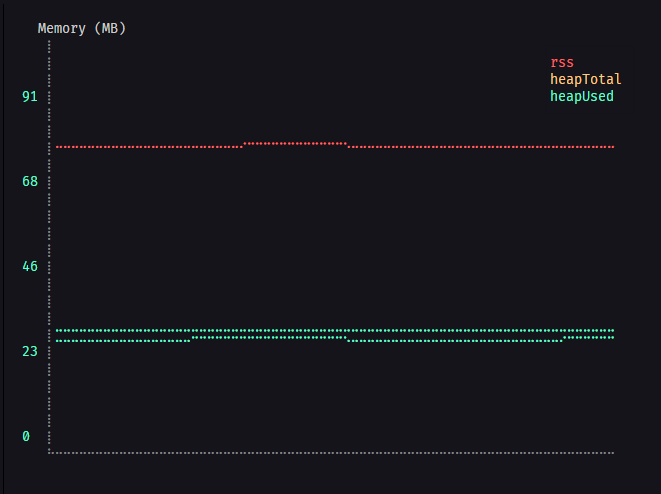
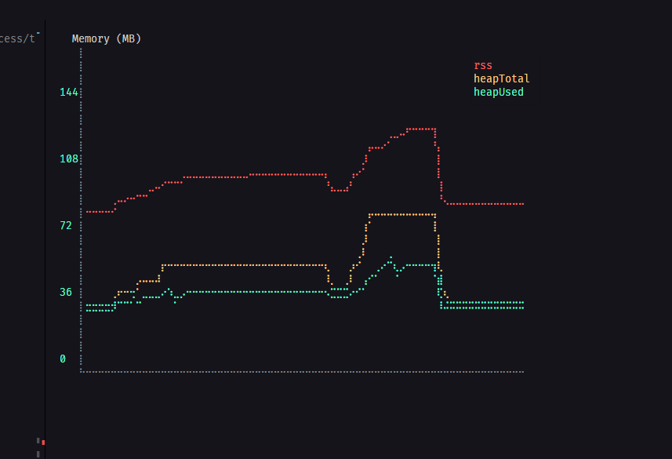
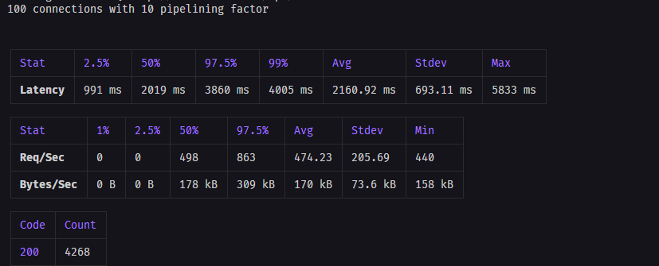
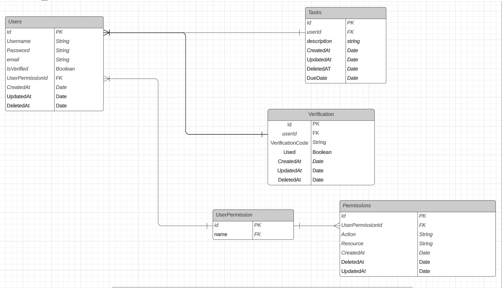

# urlShortner

### Hi there 👋

### The scope of the project is:

### Stacks and API'S

#### Using <a href="https://docs.docker.com/compose/"> docker-compose </a> we can define and run multi-container Docker applications.

#### Using <a href="https://sequelize.org/"> sequelize </a> we can work with <a href="https://www.postgresql.org/"> PostgreSQL</a> database.

#### Using <a href="https://expressjs.com/pt-br/"> EspressJS framework </a> we can create routes abstractions, middlewares and many other functions to facilitate the creation of both API's and SPA's.

### To start the project:

1. Open two terminals

   - Enter the repository folder 'back-end':
     - `cd back-end`

2. Install the dependecies

   - Using: `npm install`

3. Start the application

   - Using: `npm run build && npm run pm2:start` you will initialize the application
   - Using: `npm run start:dev` you will initialize the application with nodemon.
   - Using: `docker compose up` you will initialize the application with postgres with docker.

4. In the other terminal

   - Enter the repository folder 'front-end':
     - `cd front-end`

5. Install the dependecies

   - Using: `npm install`

6. Start the application

   - Using: `npm start` you will initialize the application.

### Application memory:

#### Inside 'src/benchmark', there is two files : memory and memory-usage

#### those images provides the usage of the memory of the application, and monitors if the application has any memory leak

#### for make it possible i am using the <a href="https://www.npmjs.com/package/climem"> climem </a> library

## Due to the library feedback we can see that we have no memory leak in the application

### Application performance:

#### Inside 'src/benchmark', there is one file : performance

#### that maps the application load test with 100 concurrency 10 pipeline in 10 seconds

#### for make it possible i am using the <a href="https://www.npmjs.com/package/autocannon"> autocannon </a> library

### Next Steps:

#### Thinking that this first step would be an MVP (Minimum Viable Product) of the application, in it, we still have limited functionalities and minimal user interaction and control. To address this, we have implemented new features in the database model, enhancing control over operations within the application and fostering increased user interaction. Additionally, we are incorporating email communication to strengthen user engagement and maintain relationships.

#### To fulfill this objective, a database model has been created and will be provided to developers for the commencement of implementation."

## Enjoy!! 😊😊

#### My <a href="https://www.linkedin.com/in/brenomesquita/"> LinkedIn </a>.
